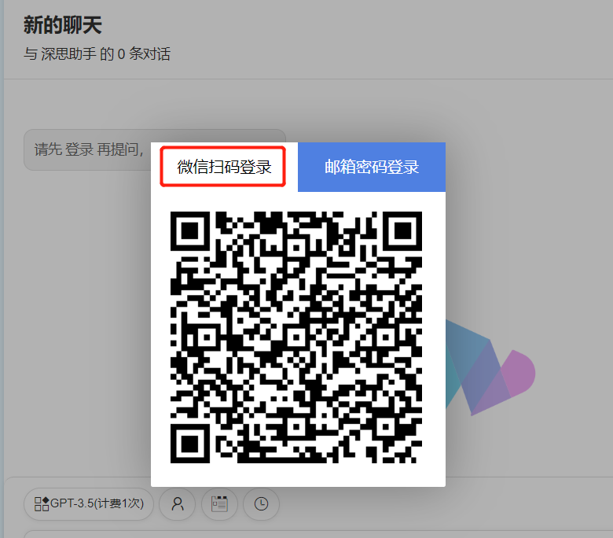
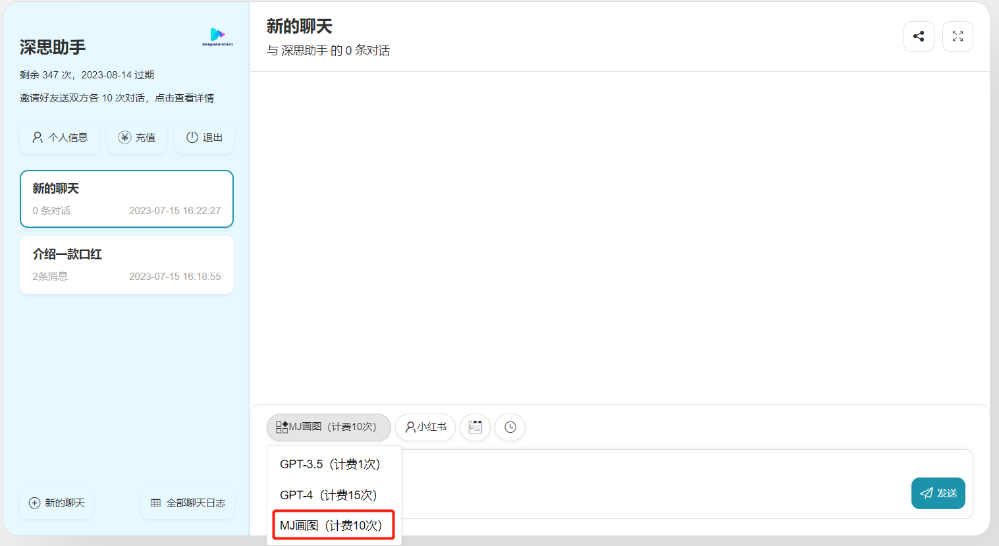
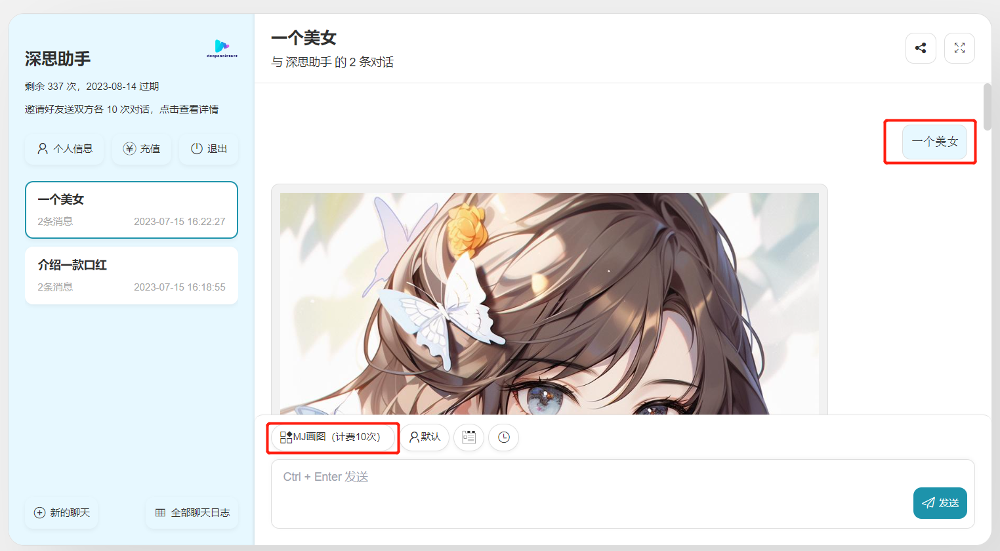
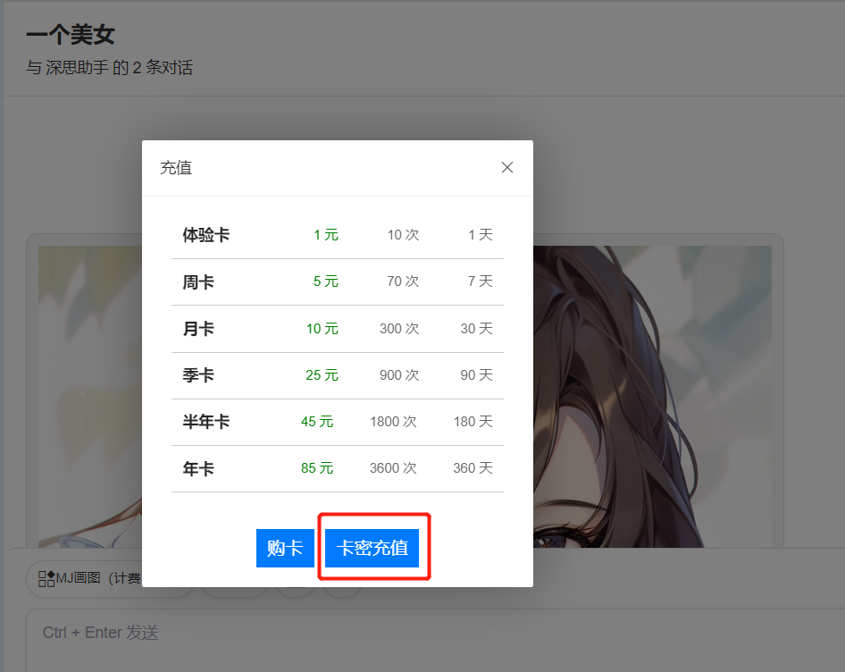

> 提供免费ChatGpt和Midjourney绘图

# ✨ 欢迎来到 Deep Assistant✨

### **https://deepassistant.cn/**

## 🧱 Deep Assistant 功能简介

使用中如果遇到任何问题请加QQ

**QQ：1535946458** 

备注：deepassistant

### 一、登录

为了防止有人恶意注册，浪费网站资源，网站采用首次登录必须使用微信登录，首次登录之后可以选择更新账号密码信息，下次登录可以选择账号密码。

登录图示如下：

1. 登录界面，点击一键登录

   

2. 首次登录必须选择微信扫码，扫码成功后才能够进行邮箱和登录密码设置，下次登陆即可使用邮箱和密码登录页面。

   

   

### 二、ChatGPT对话机器人

**GPT3.5**

目前由于成本原因只提供GPT3.5功能

使用方法如下：

选择模型为GPT-3.5，如果不选择则默认为此选项。

直接在输入框输入文字即可开始对话，每次对话消耗一次。连续问答（用户输入+GPT回答）字数最大支持3000字左右，太长可能会出错

**ChatGPT 快速角色扮演**

其他角色欢迎尝试~

### 三、MidJourney绘图功能

支持中英文，本质上输入中文会调用百度翻译api，转化成英文，如果有能力还是自己写英文效果最好。

如下图：输入中文 画一个可爱的小姑娘，油画风格，midjoury画图速度比较慢需要您耐心等待，但是效果很好。

**图片保存**

midjourney画的图可以在网页上直接保存

### 四、充值

1. 网站注册即送100次问答，有效期30天。用完以后可以**购买充值卡密码**进行充值。

2. 如果次数用完，可以按照以下步骤充值

购买充值卡，会获得对应级别的充值卡密码，按照下图操作充值即可。

## 🍥 AI导航站

https://navigation.deephour.com

导航站收录了包括本网站在内的百余AI资源，工具，学习网站，方便您的日常工作学习使用，网站有免费有付费请您仔细辨别。

## 🔣 博客站

https://finley1991.github.io/

博客站记录博主一些播客，个人性质更多一些，目前正在建设，还不完善，希望大家多多支持。

